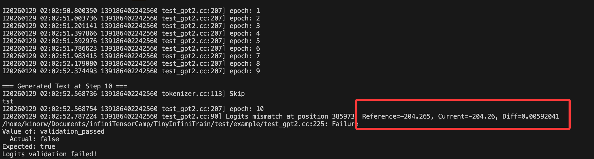

# TinyInfiniTrain 作业报告

## 一、test 通过截图


## 二、作业步骤

> 将代码填入下面代码块中指定位置，并详细描述完成该作业的解决思路和遇到的问题。

### 作业一：autograd机制调用Neg kernel的实现

难度：⭐

对应测例：`TEST(ElementwiseTest, NegForward)`，`TEST(ElementwiseTest, NegBackward)`

需要实现的代码块位置：`infini_train/src/autograd/elementwise.cc`

```c++
std::vector<std::shared_ptr<Tensor>> Neg::Forward(const std::vector<std::shared_ptr<Tensor>> &input_tensors) {
    // =================================== 作业 ===================================
    // TODO：通过Dispatcher获取设备专属kernel，对输入张量进行取反操作
    // HINT: 依赖test_dispatcher，kernel实现已给出
    // =================================== 作业 ===================================
    CHECK_EQ(input_tensors.size(), 1);
    const auto &input = input_tensors[0];

    auto device = input->GetDevice().Type();
    auto kernel = Dispatcher::Instance().GetKernel({device, "NegForward"});
    return {kernel.Call<std::shared_ptr<Tensor>>(input)};
}

std::vector<std::shared_ptr<Tensor>> Neg::Backward(const std::vector<std::shared_ptr<Tensor>> &grad_outputs) {
    // =================================== 作业 ===================================
    // TODO：通过Dispatcher获取设备专属的反向传播kernel，计算梯度
    // HINT: 依赖test_dispatcher，kernel实现已给出
    // =================================== 作业 ===================================
    CHECK_EQ(grad_outputs.size(), 1);
    const auto &grad_output = grad_outputs[0];
    
    auto device = grad_output->GetDevice().Type();
    auto kernel = Dispatcher::Instance().GetKernel({device, "NegBackward"});
    return {kernel.Call<std::shared_ptr<Tensor>>(grad_output)};    
}
```

#### 解决思路
1. 观察其他算子实现，了解autograd机制中Forward和Backward的调用流程。
2. 使用Dispatcher获取对应设备类型的kernel，并调用相应的前向和反向函数。（注意调用传入的参数）


#### 遇到问题
无


### 作业二：实现矩阵乘法

难度：⭐⭐

#### CPU实现

对应测例：`TEST(MatmulTest, BasicMatrixMultiply)`，`TEST(MatmulTest, BatchedMatrixMultiply)`, `TEST(MatmulTest, BackwardPass)`

需要实现的代码块位置：`infini_train/src/kernels/cpu/linear.cc`

```c++
    std::shared_ptr<Tensor> MatmulForward(const std::shared_ptr<Tensor> &input, const std::shared_ptr<Tensor> &other) {
        // =================================== 作业 ===================================
        // TODO：实现CPU上的矩阵乘法前向计算
        // REF:
        // =================================== 作业 ===================================
        if (input->Dims().size()==2 && other->Dims().size()==2) {
            auto output = std::make_shared<Tensor>(
                std::vector<int64_t>{input->Dims()[0], other->Dims()[1]}, DataType::kFLOAT32);
            output->EigenMatrix() = input->EigenMatrix() * other->EigenMatrix();
            return output;            
        }else {
            const auto &input_dims = input->Dims();
            const auto &other_dims = other->Dims();        

            // 计算输出维度,假设batch维度无需广播处理（纬度数一致且相等）
            CHECK_EQ(input_dims.size(), other_dims.size());
            size_t max_rank = input_dims.size();
            std::vector<int64_t> output_dims(max_rank);
            output_dims[max_rank - 2] = input_dims[input_dims.size() - 2];
            output_dims[max_rank - 1] = other_dims[other_dims.size() - 1];
            
            for (int i = 0; i < max_rank - 2; ++i) {
                int64_t dim1 = input_dims[max_rank - 3 - i];
                int64_t dim2 = other_dims[other_dims.size() - 3 - i];
                CHECK_EQ(dim1, dim2);
                output_dims[max_rank - 3 - i] = dim1;
            }

            auto output = std::make_shared<Tensor>(output_dims, DataType::kFLOAT32);
            
            const int64_t M = input_dims[input_dims.size() - 2];
            const int64_t K = input_dims[input_dims.size() - 1];
            const int64_t N = other_dims[other_dims.size() - 1];

            const int64_t batch_size = std::accumulate(output_dims.begin(), output_dims.end() - 2, 1, std::multiplies<int64_t>{});

            float* in_ptr = input->EigenMatrix().data();
            float* other_ptr = other->EigenMatrix().data();
            float* out_ptr = output->EigenMatrix().data();
            for (int i = 0; i < batch_size; ++i) {
                long in_off = i * M * K;
                long other_off = i * K * N;
                long out_off = i * M * N;
                
                Eigen::Map<const Eigen::Matrix<float, Eigen::Dynamic, Eigen::Dynamic, Eigen::RowMajor>> mat_in(
                    in_ptr + in_off, M, K);
                Eigen::Map<const Eigen::Matrix<float, Eigen::Dynamic, Eigen::Dynamic, Eigen::RowMajor>> mat_other(
                    other_ptr + other_off, K, N);
                Eigen::Map<Eigen::Matrix<float, Eigen::Dynamic, Eigen::Dynamic, Eigen::RowMajor>> mat_out(
                    out_ptr + out_off, M, N);
                
                mat_out.noalias() = mat_in * mat_other;
            }
            return output;
        }
    }

    std::tuple<std::shared_ptr<Tensor>, std::shared_ptr<Tensor>>
        MatmulBackward(const std::shared_ptr<Tensor> &input, const std::shared_ptr<Tensor> &other,
                    const std::shared_ptr<Tensor> &grad_output) {
        // =================================== 作业 ===================================
        // TODO：实现CPU上的矩阵乘法反向传播
        // REF:
        // =================================== 作业 ===================================
        auto grad_input = std::make_shared<Tensor>(input->Dims(), DataType::kFLOAT32);
        auto grad_other = std::make_shared<Tensor>(other->Dims(), DataType::kFLOAT32);
        if (input->Dims().size()==2 && other->Dims().size()==2 && grad_output->Dims().size()==2) {
            grad_input->EigenMatrix() = grad_output->EigenMatrix() * other->EigenMatrix().transpose();
            grad_other->EigenMatrix() = input->EigenMatrix().transpose() * grad_output->EigenMatrix();
        } else {
            // bmm反向传播
            const auto &input_dims = input->Dims();
            const auto &other_dims = other->Dims();
            const auto &grad_dims = grad_output->Dims();

            const int64_t batch_size = std::accumulate(grad_dims.begin(), grad_dims.end() - 2, 1, std::multiplies<int64_t>{});

            // 初始化梯度为0
            grad_input->EigenMatrix().setZero();
            grad_other->EigenMatrix().setZero();

            float* in_ptr = input->EigenMatrix().data();
            float* other_ptr = other->EigenMatrix().data();
            float* g_out_ptr = grad_output->EigenMatrix().data();
            float* g_in_ptr = grad_input->EigenMatrix().data();
            float* g_other_ptr = grad_other->EigenMatrix().data();

            const int64_t M = input_dims[input_dims.size() - 2];
            const int64_t K = input_dims[input_dims.size() - 1];
            const int64_t N = other_dims[other_dims.size() - 1];

            for (int i = 0; i < batch_size; ++i) {
                long in_off = i * M * K;
                long other_off = i * K * N;
                long out_off = i * M * N;

                Eigen::Map<const Eigen::Matrix<float, Eigen::Dynamic, Eigen::Dynamic, Eigen::RowMajor>> mat_in(
                in_ptr + in_off, M, K);
                Eigen::Map<const Eigen::Matrix<float, Eigen::Dynamic, Eigen::Dynamic, Eigen::RowMajor>> mat_other(
                other_ptr + other_off, K, N);
                Eigen::Map<const Eigen::Matrix<float, Eigen::Dynamic, Eigen::Dynamic, Eigen::RowMajor>> mat_g_out(
                g_out_ptr + out_off, M, N);
                
                Eigen::Map<Eigen::Matrix<float, Eigen::Dynamic, Eigen::Dynamic, Eigen::RowMajor>> mat_g_in(
                g_in_ptr + in_off, M, K);
                Eigen::Map<Eigen::Matrix<float, Eigen::Dynamic, Eigen::Dynamic, Eigen::RowMajor>> mat_g_other(
                g_other_ptr + other_off, K, N);
                
                mat_g_in.noalias() += mat_g_out * mat_other.transpose();
                mat_g_other.noalias() += mat_in.transpose() * mat_g_out;
            }
        }
        return {grad_input, grad_other};
    }
```

#### CUDA实现

对应测例：`TEST(MatmulTest, BasicMatrixMultiplyCuda)`,`TEST(MatmulTest, BatchedMatrixMultiplyCuda)`,`TEST(MatmulTest, BackwardPassCuda)`

需要实现的代码块位置：`infini_train/src/kernels/cuda/linear.cu`

```c++
    std::shared_ptr<Tensor> MatmulForward(const std::shared_ptr<Tensor> &input, const std::shared_ptr<Tensor> &other) {
        // =================================== 作业 ===================================
        // TODO：实现CUDA上的矩阵乘法前向计算
        // REF:
        // =================================== 作业 ===================================
        const auto &input_dims = input->Dims();
        const auto &other_dims = other->Dims();        
        CHECK_EQ(input_dims.size(), other_dims.size());
        size_t max_rank = input_dims.size();
        std::vector<int64_t> output_dims(max_rank);
        const int64_t M = input_dims[input_dims.size() - 2];
        const int64_t K = input_dims[input_dims.size() - 1];
        const int64_t N = other_dims[other_dims.size() - 1];
        const int64_t batch_size = std::accumulate(input_dims.rbegin() + 2, input_dims.rend(), 1, std::multiplies<int64_t>{});
        output_dims[max_rank - 2] = M;
        output_dims[max_rank - 1] = N;
        
        for (int i = 0; i < max_rank - 2; ++i) {
            int64_t dim1 = input_dims[max_rank - 3 - i];
            int64_t dim2 = other_dims[other_dims.size() - 3 - i];
            CHECK_EQ(dim1, dim2);
            output_dims[max_rank - 3 - i] = dim1;
        }

        const float alpha = 1.0f;
        const float beta = 0.0f;
        cublasHandle_t handle;
        CUBLAS_CHECK(cublasCreate(&handle));

        auto output = std::make_shared<Tensor>(output_dims, DataType::kFLOAT32, input->GetDevice());
        
        CUBLAS_CHECK(cublasSgemmStridedBatched(handle, CUBLAS_OP_N, CUBLAS_OP_N, N, M, K, &alpha,
                                static_cast<const float *>(other->DataPtr()), N, K * N,
                                static_cast<const float *>(input->DataPtr()), K, M * K,&beta,
                                static_cast<float *>(output->DataPtr()), N, M * N,
                                batch_size));
        CUBLAS_CHECK(cublasDestroy(handle));

        return output;
    }

    std::tuple<std::shared_ptr<Tensor>, std::shared_ptr<Tensor>>
        MatmulBackward(const std::shared_ptr<Tensor> &input, const std::shared_ptr<Tensor> &other,
                    const std::shared_ptr<Tensor> &grad_output) {
        // =================================== 作业 ===================================
        // TODO：实现CUDA上的矩阵乘法反向传播
        // REF:
        // =================================== 作业 ===================================
        const float alpha = 1.0f;
        const float beta = 0.0f;
        const auto &input_dims = input->Dims();
        const auto &other_dims = other->Dims();
        cublasHandle_t handle;
        CUBLAS_CHECK(cublasCreate(&handle));
        auto grad_input = std::make_shared<Tensor>(input_dims, DataType::kFLOAT32, input->GetDevice());
        auto grad_other =  std::make_shared<Tensor>(other_dims, DataType::kFLOAT32, other->GetDevice());
        
        const int64_t M = input_dims[input_dims.size() - 2];
        const int64_t K = input_dims[input_dims.size() - 1];
        const int64_t N = other_dims[other_dims.size() - 1];
        const int64_t batch_size = std::accumulate(input_dims.rbegin() + 2, input_dims.rend(), 1, std::multiplies<int64_t>{});

        CUBLAS_CHECK(cublasSgemmStridedBatched(handle, CUBLAS_OP_T, CUBLAS_OP_N, K, M, N, &alpha,
                                static_cast<const float *>(other->DataPtr()), N, K * N,
                                static_cast<const float *>(grad_output->DataPtr()), N, M * N, &beta,
                                static_cast<float *>(grad_input->DataPtr()), K, M * K,
                                batch_size));

        CUBLAS_CHECK(cublasSgemmStridedBatched(handle, CUBLAS_OP_N, CUBLAS_OP_T, N, K, M, &alpha,
                                static_cast<const float *>(grad_output->DataPtr()), N, M * N,
                                static_cast<const float *>(input->DataPtr()), K, M * K, &beta,
                                static_cast<float *>(grad_other->DataPtr()), N, K * N,
                                batch_size));
        CUBLAS_CHECK(cublasDestroy(handle));
        return {grad_input, grad_other};
    }
```

#### 解决思路
1. CPU端：导入有`Eigen`库，使用其矩阵乘法即可。 对于`batched`情况，使用循环遍历每个batch进行矩阵乘法计算。
2. CUDA端：使用`cuBLAS`库的`cublasSgemmStridedBatched`函数实现批量矩阵乘法。需要注意矩阵的行列顺序(`cuBLAS`使用列主序存储)。
3. 反向传播，依据矩阵乘法，对grad_input[i][j] = sum_k(grad_output[i][k] * other[j][k]) 有grad_input = grad_output * other^T；对other[i][j]同理


#### 遇到问题
1. 未考虑批次矩阵乘法
2. CUDA端矩阵维度顺序错误（行主序与列主序问题）


### 作业三：实现Adam优化器

难度：⭐

#### CPU实现

对应测例：`TEST(AdamOptimizerTest, BasicParameterUpdate)`,`TEST(AdamOptimizerTest, MomentumAccumulation)`

代码位置：infini_train/src/kernels/cpu/accumulate_grad.cc

```c++
void AdamAccumulateGrad(const std::shared_ptr<Tensor> &grad, const std::shared_ptr<Tensor> &param,
                        const std::shared_ptr<Tensor> &m, const std::shared_ptr<Tensor> &v, float learning_rate,
                        float beta1, float beta2, float eps, int64_t t) {
    // =================================== 作业 ===================================
    // TODO：实现Adam优化器的梯度累积和参数更新
    // REF: 
    // =================================== 作业 ===================================
    for(int64_t idx = 0 ; idx < grad->NumElements(); ++idx) {
        float g = static_cast<const float*>(grad->DataPtr())[idx];
        
        // 更新一阶动量m
        float m_new = beta1 * static_cast<float*>(m->DataPtr())[idx] + (1 - beta1) * g;
        static_cast<float*>(m->DataPtr())[idx] = m_new;
        
        // 更新二阶动量v
        float v_new = beta2 * static_cast<float*>(v->DataPtr())[idx] + (1 - beta2) * g * g;
        static_cast<float*>(v->DataPtr())[idx] = v_new;
        
        // 计算偏差修正后的动量
        float m_hat = m_new / (1 - std::pow(beta1, t));
        float v_hat = v_new / (1 - std::pow(beta2, t));
        
        static_cast<float*>(param->DataPtr())[idx] -= learning_rate * m_hat / (std::sqrt(v_hat) + eps);
    }
}
```

#### CUDA实现

对应测例：`TEST(AdamOptimizerTest, BasicParameterUpdateCuda)`,`TEST(AdamOptimizerTest, MomentumAccumulationCuda)`

代码位置：infini_train/src/kernels/cuda/accumulate_grad.cu

```c++
void AdamAccumulateGrad(const std::shared_ptr<Tensor> &grad, const std::shared_ptr<Tensor> &param,
                        const std::shared_ptr<Tensor> &m, const std::shared_ptr<Tensor> &v, float learning_rate,
                        float beta1, float beta2, float eps, int64_t t) {
    // =================================== 作业 ===================================
    // TODO：实现Adam优化器的梯度累积和参数更新
    // REF: 
    // =================================== 作业 ===================================
    size_t num_elements = grad->NumElements();

    const float *grad_ptr = static_cast<const float *>(grad->DataPtr());
    float *param_ptr = static_cast<float *>(param->DataPtr());
    float *m_ptr = static_cast<float *>(m->DataPtr());
    float *v_ptr = static_cast<float *>(v->DataPtr());
    int threads_per_block = 256;
    int num_blocks = (num_elements + threads_per_block - 1) / threads_per_block;

    AdamAccumulateGradKernel<<<num_blocks, threads_per_block>>>(grad_ptr, param_ptr, m_ptr, v_ptr, learning_rate, beta1, beta2, eps, t, num_elements);
}
```

#### 解决思路
1. 在`optimizer.cc`中了解Adam优化器调用流程，确认所需实现部分为对单个参数`param`的单次`t`更新，
2. 参照Adam算法公式，实现参数更新逻辑即可。cuda端原理相近，使用`powf`,`sqrtf`math函数替代。

#### 遇到问题
无


### 作业四：实现Tensor基础操作

#### 实现Tensor的Flatten操作

难度：⭐

对应测例：`TEST(TensorTransformTest, Flatten2DTo1D)`,`TEST(TensorTransformTest, FlattenWithRange) `,`TEST(TensorTransformTest, FlattenNonContiguous)`

代码位置：infini_train/src/tensor.cc

```c++
std::shared_ptr<Tensor> Tensor::Flatten(int64_t start, int64_t end) {
    // =================================== 作业 ===================================
    // TODO：实现张量扁平化操作，将指定维度范围[start, end]内的所有维度合并为一个维度
    // HINT: 
    // =================================== 作业 ===================================
    if (end < 0) {
        end += dims_.size();
    }
    std::vector<int64_t> new_shape;
    for (int64_t i = 0; i < dims_.size(); ++i) {
        if (i < start || i > end) {
            new_shape.push_back(dims_[i]);
        } else if (i == start) {
            int64_t flattened_dim = 1;
            for (int64_t j = start; j <= end; ++j) {
                flattened_dim *= dims_[j];
            }
            new_shape.push_back(flattened_dim);
            i += (end - start);
        }
    }
    return Contiguous()->View(new_shape);
}
```

#### 实现Tensor的反向传播机制

难度：⭐

对应测例：`TEST(TensorAutogradTest, BackwardComputesGradient)`,`TEST(TensorAutogradTest, BackwardWithMultipleOutputs)`

代码位置：infini_train/src/tensor.cc

```c++
void Tensor::Backward(std::shared_ptr<Tensor> gradient, bool retain_graph, bool create_graph) const {
    // =================================== 作业 ===================================
    // TODO：实现自动微分反向传播
    // 功能描述：1. 计算当前张量对叶子节点的梯度    2. 支持多输出场景的梯度累加
    // HINT: 
    // =================================== 作业 ===================================
    if (gradient == nullptr){
        gradient = std::make_shared<Tensor>(dims_, dtype_, GetDevice());
        gradient->Fill<float>(1.0f);
    }
    grad_fn_->BackwardPartial(gradient, output_idx_);
}
```

#### 解决思路
1. `Flatten`操作，由于现有的`tensor`已实现`View`函数，只需计算新的`shape`并调用`View`实现。
2. `Backward`操作,注意到，`autograd/function.cc`中已有`BackwardPartial`函数实现了对单个输出的梯度计算和累加，因此只需调用该函数即可。注意额外处理`gradient`为空的情况。
    - 具体的，根据`tensor.h`中自动微分相关定义，`grad_fn_`存储了生成该张量的函数指针，`output_idx_`存储了该张量在函数输出中的索引。
    - 在`BackwardPartial`中，先判断当前索引的输出梯度是否为首次得到，若是则直接赋值，否则进行累加。判断所有下游计算均完成后（ 通过比对`dependencies_reached_`和`dependencies_number_`（构图时统计）；和已计算输出数（？）），执行反向计算并向上游传播。
#### 遇到问题
`grad_outputs_reached_==grad_outputs_.size()`似乎非必要？


### 作业五 注册算子kernel的实现

难度：⭐⭐⭐

对应测例：`TEST(DispatcherTest, RegisterAndGetKernel)`,`TEST(DispatcherTest, DuplicateRegistration)`,`TEST(DispatcherTest, GetNonexistentKernel)`

代码位置：infini_train/include/dispatcher.h

```c++
template <typename RetT, class... ArgsT> RetT Call(ArgsT... args) const {
    // =================================== 作业 ===================================
    // TODO：实现通用kernel调用接口
    // 功能描述：将存储的函数指针转换为指定类型并调用
    // HINT: 
    // =================================== 作业 ==================================
    FuncT func = reinterpret_cast<FuncT>(func_ptr_);
    return func(std::forward<ArgsT>(args)...)=
}

template <typename FuncT> void Register(const KeyT &key, FuncT &&kernel) {
    // =================================== 作业 ===================================
    // TODO：实现kernel注册机制
    // 功能描述：将kernel函数与设备类型、名称绑定
    // =================================== 作业 ===================================
    CHECK(!key_to_kernel_map_.contains(key)) << "Kernel already registered: " << key.second << " on device "
                                            << static_cast<int>(key.first);
    key_to_kernel_map_.emplace(key, KernelFunction(std::forward<FuncT>(kernel)));
}

#define REGISTER_KERNEL_IMPL(device, kernel_name, kernel_func, line)                                                   \
    static const bool _registered_kernel_##line = []() {                                                               \
        infini_train::Dispatcher::Instance().Register({device, #kernel_name}, kernel_func);                            \
        return true;                                                                                                   \
    }();

#define REGISTER_KERNEL_WRAP(device, kernel_name, kernel_func, line)                                                   \
    REGISTER_KERNEL_IMPL(device, kernel_name, kernel_func, line)


#define REGISTER_KERNEL(device, kernel_name, kernel_func)                                                              \
    REGISTER_KERNEL_WRAP(device, kernel_name, kernel_func, __LINE__)
    // =================================== 作业 ===================================
    // TODO：实现自动注册宏
    // 功能描述：在全局静态区注册kernel，避免显式初始化代码
    // =================================== 作业 ===================================

```

#### 解决思路
主要熟悉框架与C++模版编程
1. 通用调用接口：将传入的`void*`泛型指针转换为具体的函数指针(`RetT (*)(ArgsT...)`)，使用`std::forward`转发参数并调用。
2. 注册：使用`map`存储`key`到`KernelFunction`的映射，注册时检查重复，将函数指针封装在`KernelFunction`中存储。
3. 自动注册宏：利用C++的静态初始化特性，定义一个静态布尔变量，其初始化表达式使用立即执行的`lambda`函数，完成注册操作。使用`__LINE__`确保每个注册实例的唯一性。

#### 遇到问题
1. `__LINE__`直接拼接时无法正确替换，通过增加一层宏包装，强制预处理器先展开行号解决。


### 作业六：实现GPT-2整体训练

难度：⭐⭐⭐⭐

对应测例：`TEST_F(GPT2TrainingTest, LogitsConsistency)`

#### 训练过程logits对比

完成以上所有作业，补齐训练框架的所有实现，理论上`TEST_F(GPT2TrainingTest, LogitsConsistency)`可以通过，在用例中判断比较预置的值和单步正向传播计算结果是否在误差允许范围内相等。

#### 数据读取实现

代码位置：example/common/tiny_shakespeare_dataset.cc

```c++
TinyShakespeareFile ReadTinyShakespeareFile(const std::string &path, size_t sequence_length) {
    /* =================================== 作业 ===================================
       TODO：实现二进制数据集文件解析
       文件格式说明：
    ----------------------------------------------------------------------------------
    | HEADER (1024 bytes)                     | DATA (tokens)                        |
    | magic(4B) | version(4B) | num_toks(4B) | reserved(1012B) | token数据           |
    ----------------------------------------------------------------------------------
       =================================== 作业 =================================== */
    std::ifstream ifs(path, std::ios::binary);
    TinyShakespeareFile result;
    auto header_bytes = ReadSeveralBytesFromIfstream(1024, &ifs);
    int32_t magic = BytesToType<int32_t>(header_bytes, 0);
    int32_t version = BytesToType<int32_t>(header_bytes, 4);
    int32_t num_toks = BytesToType<int32_t>(header_bytes, 8);
    CHECK(kTypeMap.count(magic)) << "Unknown magic number: " << magic;
    result.type = kTypeMap.at(magic);
    int64_t type_size = kTypeToSize.at(result.type);
    result.dims = {static_cast<int64_t>(num_toks / sequence_length), static_cast<int64_t>(sequence_length)};

    // 创建 INT64 类型的 Tensor 并转换数据
    result.tensor = infini_train::Tensor({static_cast<int64_t>(num_toks)}, DataType::kINT64);
    int64_t *dst = static_cast<int64_t *>(result.tensor.DataPtr());

    auto token_bytes = ReadSeveralBytesFromIfstream(num_toks * type_size, &ifs);
    if (result.type == TinyShakespeareType::kUINT16) {
        for (int32_t i = 0; i < num_toks; ++i) {
            dst[i] = BytesToType<uint16_t>(token_bytes, i * type_size);
        } 
    } else {  // kUINT32
        for (int32_t i = 0; i < num_toks; ++i) {
            dst[i] = BytesToType<uint32_t>(token_bytes, i * type_size);
        }
    }

    return result;
}

TinyShakespeareDataset::TinyShakespeareDataset(const std::string &filepath, size_t sequence_length)
    : text_file_(ReadTinyShakespeareFile(filepath, sequence_length)),
      sequence_length_(sequence_length),
      sequence_size_in_bytes_(sequence_length * sizeof(int64_t)),
      num_samples_(text_file_.dims[0] - 1) {
    // =================================== 作业 ===================================
    // TODO：初始化数据集实例
    // HINT: 调用ReadTinyShakespeareFile加载数据文件
    // =================================== 作业 ===================================
}
```

#### Tokenizer功能实现

代码位置：example/common/tokenizer.cc

```c++
Tokenizer::Tokenizer(const std::string &filepath) {
    /* ===================================== 作业 =====================================
    TODO：实现Tokenizer二进制文件加载

    文件格式说明：
    ----------------------------------------------------------------------------------
    | HEADER (1024 bytes)                     | VOCAB TABLE                           |
    | magic(4B) | version(4B) | vocab_size(4B) | reserved(1012B) | token词表数据       |
    ----------------------------------------------------------------------------------
    ===================================== 作业 ===================================== */
    std::ifstream ifs(filepath, std::ios::binary);
    // 读取header (1024 bytes = 256 * 4 bytes)
    auto header_bytes = ReadSeveralBytesFromIfstream(1024, &ifs);
    magic_number_ = BytesToType<uint32_t>(header_bytes, 0);
    uint32_t version = BytesToType<uint32_t>(header_bytes, 4);
    vocab_size_ = BytesToType<uint32_t>(header_bytes, 8);

    CHECK(kEotMap.count(magic_number_)) << "Unknown magic number: " << magic_number_;
    eot_token_ = kEotMap.at(magic_number_);

    // 读取词表数据 (1字节长度 + token字符串)
    token_table_.resize(vocab_size_);
    for (uint32_t i = 0; i < vocab_size_; ++i) {
        uint8_t token_len;
        ifs.read(reinterpret_cast<char *>(&token_len), 1);
        std::string token(token_len, '\0');
        ifs.read(&token[0], token_len);
        token_table_[i] = token;
    }
}
```

```c++
std::string Tokenizer::Decode(uint32_t token_id) const {
    /* ===================================== 作业 =====================================
    TODO：实现token_id到文本的转换
    功能描述：根据token_id返回对应的文本片段
    ===================================== 作业 ===================================== */
    CHECK_LT(token_id, vocab_size_) << "Token ID out of range: " << token_id;
    return token_table_[token_id];
}
```

```c++
void Tokenizer::GenerateText(infini_train::nn::Module &model, uint32_t batch_size, uint32_t sequence_length,
                             uint32_t text_length, Device device) const {
    /* ...原代码... */
    LOG(INFO) << "start generate text:";
    for (int t = prompt_len; t < text_length; t++) {
        /* ===================================== 作业 =====================================
        TODO：实现单步文本生成逻辑
        HINT：调用model.Forward推理获取logits，根据推理结果进行随机采样，调用Decode获取文本结果
        ===================================== 作业 ===================================== */
        auto output = model.Forward({x}); // GPT2/net.cc
        auto logits = output[0]; // (bs, seq_len, vocab_size)
        auto logits_dims = logits->Dims();
        int64_t vocab_size = logits_dims[2];
        auto logits_cpu = logits->To(Device(DeviceType::kCPU, 0));
        float* logits_ptr = static_cast<float*>(logits_cpu.DataPtr());

        for(uint32_t b = 0; b < batch_size; ++b) {
            // 获取最后一个有效位置(t-1)的logits
            float* logits_start = logits_ptr + b * sequence_length * vocab_size + (t - 1) * vocab_size;

        // softmax
        float max_logit = *std::max_element(logits_start, logits_start + vocab_size);
        std::vector<float> exp_logits(vocab_size);
        float sum_exp = 0.0f;
        for(int64_t v = 0; v < vocab_size; ++v) {
            exp_logits[v] = std::exp(logits_start[v] - max_logit);
            sum_exp += exp_logits[v];
        }
        for(int64_t v = 0; v < vocab_size; ++v) {
            exp_logits[v] /= sum_exp;
        }

        // sample
            float coin = RandomF32(kRngState);
            int sampled_token_id = SampleMult(exp_logits.data(), vocab_size, coin);
            x_buff[b * sequence_length + t] = sampled_token_id;

            // decode and print 
            std::string token_str = Decode(static_cast<uint32_t>(sampled_token_id));
            std::cout << token_str;
        }
        // 将更新后的 CPU 数据同步到 GPU
        x = std::make_shared<infini_train::Tensor>(x_tensor.To(device));
    }
    std::cout << std::endl;
}
```

#### 解决思路
1.  数据加载：读取 1024 字节的文件头获取元数据（Magic Number, Token总数等），根据 Magic Number 判定源数据是 `uint16` 还是 `uint32`，然后将其批量读取并转换为框架使用的 `int64` Tensor。
2.  Tokenizer：处理 `[Header] + [Vocab List]`，词表项采用 `[1字节长度][字符串内容]` 的紧凑格式存储（通过xxd -s 1024 -l xxx可视化确认）。解码时直接索引词表数组返回对应字符串。
3.  文本生成：送入当前序列进行`softmax`,采样，更新输入序列。注意数据在CPU/GPU间的同步。

#### 遇到问题
1.  文件格式读取，较为陌生开始不知道如何下手。
2.  本地显存不足，无法频繁开销创建与销毁`handle`，在`linear`中进行简单修改。（参考往届实现后，仍无法解决在生成文本样例时出现的问题，后续在服务器上尝试一下）